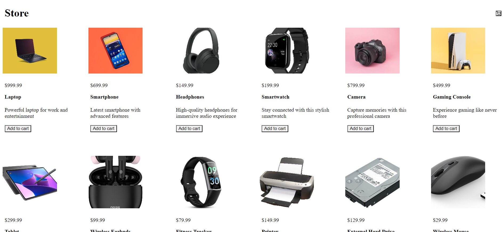
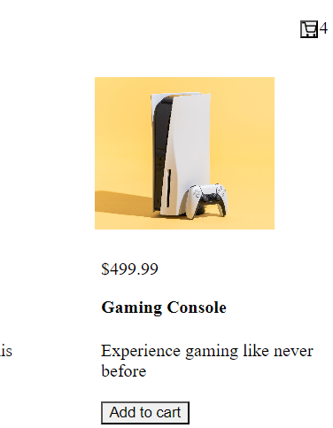
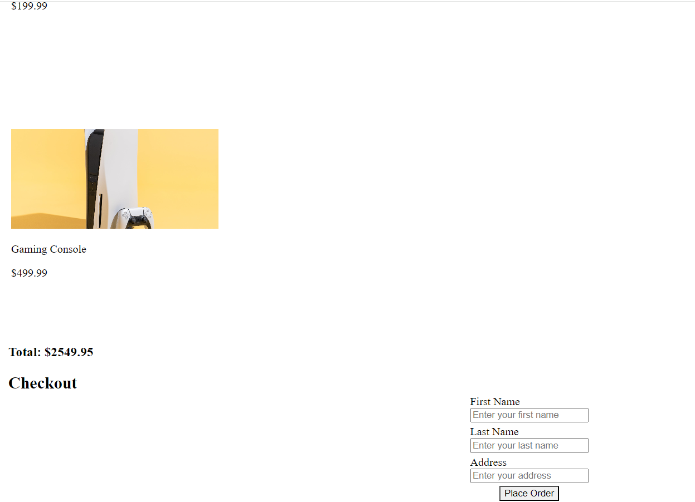
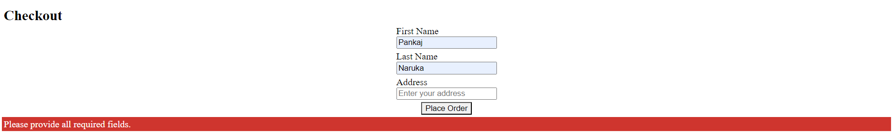
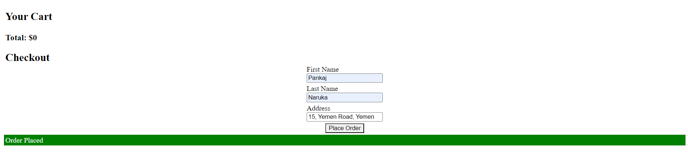

# Blog App

## Description:
This is a simple e-commerce app built on Node and React. \
Express is used to write APIs.

## Table of Contents

- [Installation](#installation)
- [Usage](#usage)
- [Screenshots](#screenshots)
- [Contributing](#contributing)
- [Additional Information](#addinfo)

## Installation :
To install the project, follow these steps:

Clone the repository: `https://github.com/pnaruka/online_store`\
Navigate to the project directory: `cd online_store`

Install dependencies: `npm install`

## Usage :
After installation, you can use the project as follows:

Run the project: `npm start`\
Access the application through your web browser at `http://localhost:8888` \
(You can change the port in index.js file)

## Screenshots :
`Homepage`:  \
`Cart Count`:  \
`Cart View`:  \
`Form Error`:  \
`Order Placed`:  

## Contributing :
Contributions are welcome! Here's how you can contribute:\
Fork the repository\
Create a new branch: `git checkout -b feature`\
Make your changes and commit them: `git commit -am 'Add new feature'`\
Push to the branch: `git push origin feature`\
Submit a pull request

## Additional Information 

For additional information or support, please contact the project maintainers at pankajnaruka111@gmail.com.